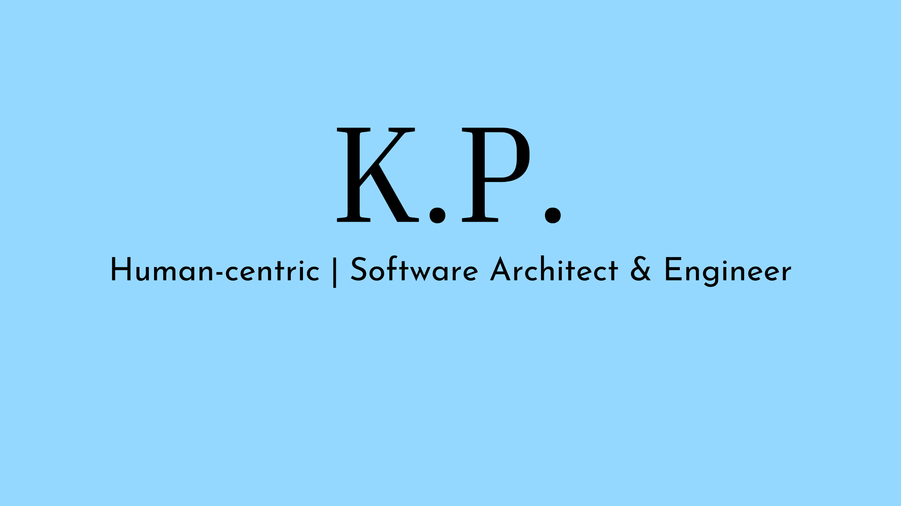

Hey there! 👋🏻,

I am KP, a human-centric architect and developer.
I am interested in developing applications for everyday users by simplifying complex architectures.
During my downtime, I contiune to study software, more specifically where software technology is headed.

Develop in Javascript, Typescript, Python and Java.

Interested in Containers, Kubernetes, Sustainable Blockchain, The iterative process towards Web3.

## 📬 :pen: My Contact

- LinkedIn: [linkedin.com/in/engineer-k-yang][2]
- Web: TBA

## 🌳 Thoughts on paper

Stay tuned for my blog!

If you want to know more about my thought process head over to my blog on Medium.
You will find here mainly reads more on the future of software. Occasionally a tutorial or two. :computer:

- Medium: [medium.com/@engr-kpyang][3]

## &#x1f4c8; My GitHub Stats

[1]: https://www.canva.com/design/DAFMJHvWmx4/Kt5G95VmUuEXbxC-Uk5WmQ/view?utm_content=DAFMJHvWmx4&utm_campaign=designshare&utm_medium=link&utm_source=homepage_design_menu
[2]: https://www.linkedin.com/in/engineer-k-yang/
[3]: https://medium.com/@engr-kpyang
